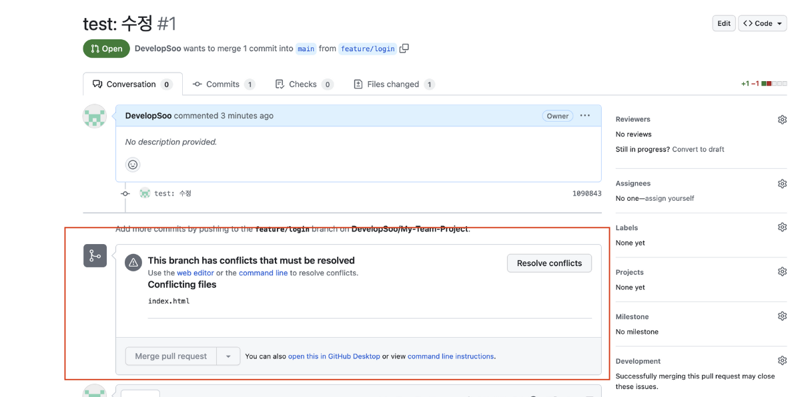

# 바닐라 자바스크립트 팀 프로젝트

## 개요
팀 프로젝트는 Github PR(Pull Request)을 이용하여 진행합니다.  
아래 사항을 잘 따라와 주시면 감사하겠습니다.

## Step
1. 해당 레포지토리를 git clone해서 각자의 로컬 PC에 가져옵니다.
2. 레포지토리에서 issues에 들어가 TODO를 확인해 주세요.

3. 각자 업무 분담이 끝났다면 각자의 로컬 환경에서 branch를 생성하여 구현을 시작합니다.

## Git 업무 로테이션
git 협업 툴 사용에 관한 상세 설명 페이지를 참조합니다. [git 상세 설명 페이지 보기](https://teamsparta.notion.site/Github-3f4ee9e7ab2741368648f90acec31835)  

github툴 협업 시 업무 세부 순서는 아래와 같습니다.

> 📌 현재 git clone까지 마친 상태를 전제로 합니다.  
1. issues를 보고 기능 구현을 담당합니다.

2. `git checkout -b 브랜치이름`을 통해 브랜치를 생성합니다.
  - 브랜치명은 영어로 작성하시되 컨벤션을 지켜주세요. (작업형태/내용)
  - ex) 상세페이지 기능구현 시 `feat/detail_page_html`와 같은 형태로 지어주세요.

3. 생성한 브랜치에 머무르는 상태에서 `git pull origin main`을 입력해서 최신 데이터를 가져옵니다.

4. 기능 구현 시작 (반드시 주어진 업무 만큼만 구현합니다.)

5. `git add .` 을 입력하여 작업 내용을 스테이지에 올립니다.  

6. `git commit`을 입력하여 커밋 메시지를 작성합니다. (하단의 컨벤션 참조)
  - 커밋 작성 예시는 아래와 같습니다.  
  > feat: 상세 페이지 html, css 틀 구현  
  > (한 줄 띄우고)  
  > 상세페이지 기능 구현 완료하였습니다. 코드 확인 부탁드립니다.

7. `git push origin 브랜치이름`을 통해 push 합니다.

8. git clone했던 레퍼지토리 사이트로 이동합니다.

9. 정상적으로 push가 완료되었다면 아래와 같은 그림이 떠야 합니다.  
  

10. Compare & pull request를 클릭하여 내용을 작성해줍니다.
  - git commit할 당시 작성한 내용이 그대로 전달되었다면 굳이 수정하지 않습니다.

11. Create pull request를 클릭하여 PR을 생성합니다.

12. 만약 아래와 같이 Conflict가 발생했다면 해결이 필요합니다. (해결방법은 git 상세설명 페이지 참조)  

13. confilict까지 해결이 되었다면 다른 팀원들에게 코드리뷰를 받고, 프로젝트 Owner에게 승인(Approval)을 받으면 main 브랜치에 코드가 등록됩니다.

14. 이제 main 브랜치의 코드가 변동되었기 때문에 다른 작업자들은 각자의 브랜치에서 `git pull origin main`을 또 진행해야 합니다. 이 과정에서 conflict가 발생할 수 있으며 이 또한 팀원과의 소통을 통해 해결해가야 합니다.

## Git 컨벤션 참고
|태그명|설명|  
|---|---|  
|feat|새로운 기능 추가|  
|fix|버그 수정|  
|refactor|리팩토링|  
|style|스타일 (코드 형식, 세미콜론 추가: 비즈니스 로직에 변경 없음)|  
|docs|문서 (문서 추가, 수정, 삭제)|  
|test|테스트 (테스트 코드 추가, 수정, 삭제: 비즈니스 로직에 변경 없음)|  
|chore|기타 변경사항 (빌드 스크립트 수정 등)|
