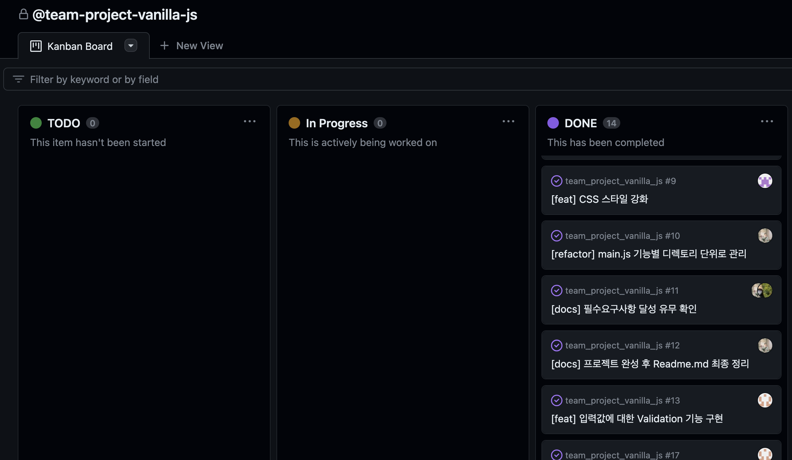

# 바닐라 자바스크립트 팀 프로젝트

## 프로젝트 개요
> ▶︎ 자바스크립트 문법에 익숙해 지기 위한 팀 프로젝트 입니다.  
> ▶︎ 영화 목록을 카드 형식으로 나열하고, 각 영화포스터를 클릭하여 상세페이지로의 전환을 구현하였습니다.  
> ▶︎ 상세페이지에서는 영화에 대한 리뷰를 작성할 수 있는 기능을 구현하였습니다.  

## 주요 구현 기능
> ▶︎ TMDB API 통신를 활용한 영화 데이터 획득 기능 구현  
> ▶︎ 제목 기준의 영화 검색 기능 구현  
> ▶︎ 모달 형식으로 영화별 상세페이지 구현   
> ▶︎ 상세 페이지 내 리뷰 작성 기능 구현 (GET, POST)  
> ▶︎ localStorage를 활용한 리뷰 작성 내역 보관

## 주요 이슈 및 문제 해결
### 1. 상세페이지 구현 방식


모달 기능을 사용하여 메인 페이지 위에 띄워지도록 구현했습니다.  

```javascript
// 영화 포스터를 클릭했을 때 모달 실행
const openModal = (movies, movieId) => {
  const modalContent = document.querySelector('.modal-content');
  const movieInfo = movies.find((movie) => movie.id === Number(movieId));

  // 모달 내용 업데이트
  modalContent.innerHTML = modalHTML(movieInfo);
  // 리뷰 뿌리기
  spreadReviews(movieId);
  // 리뷰 등록 버튼 핸들러 등록
  events.postReviewHandler(movieId);

  // 모달 창 열기
  modal.style.display = 'block';
  document.body.style.overflow = 'hidden';
  // 모달 창 닫기 핸들러 등록
  const closeModal = document.getElementById('close-modal');
  closeModal.addEventListener('click', () => {
    modal.style.display = 'none';
    document.body.style.overflow = 'auto';
  });
};
```

메인페이지에서 Default값으로 모달 태그의 display를 hide로 설정한 뒤 영화 포스터를 클릭하면 display가 block으로 바뀌는 형식으로 구현했습니다.  
특히 선택한 특정 영화에 대한 상세페이지를 구현해야 하므로 포스터 클릭 시 관련 내용와 리뷰를 가져오는 작업을 수행합니다.

---

### 2. localStorage에 데이터 저장
웹브라우저에 내장된 `localStorage`를 활용하여 리뷰 정보를 저장하도록 구현하였습니다. 
 > 📌 `localStorage?`  
 > 웹브라우저 개발자 도구의 애플리케이션에서 로컬 스토리지의 저장된 내용을 확인할 수 있습니다.  
 > 

```javascript
// 리뷰 데이터 저장
const postReview = (movieId, nickname, password, comment) => {
  // 저장된 데이터가 없을 경우 new Array를 생성합니다.
  if (localStorage.getItem(movieId) === null) {
    localStorage.setItem(movieId, JSON.stringify([])); // init
  }
  const reviewArray = JSON.parse(localStorage.getItem(movieId));
  reviewArray.push({ nickname, password, comment });
  localStorage.setItem(movieId, JSON.stringify(reviewArray));
};
```

localStorage 기능은 `getItem`과 `setItem` 메서드를 활용하여 POST와 GET을 수행할 수 있었습니다.  
localStorage는 오브젝트처럼 key, value 형태로 데이터를 저장하므로 해당 조건에서 리뷰 데이터를 어떻게 담을까 고민했으며, 결론적으로 key는 영화 ID, value에는 각각의 리뷰 정보를 오브젝트로 담아 배열로 저장하는 방식을 취했습니다.  
특히 localStorage에 저장할 때에도 서버 API에서 JSON 데이터를 주고 받을 때 처럼 JSON파싱과 Stringify 처리를 필수로 해주어야 한다는 점을 몰라서 조금 해맸습니다.  

---

## 필수 요구 사항
[1] 오픈 API 활용  
- [x] TMDB OPEN API  

[2] 영화 정보 상세 페이지 구현
- [x] 포스터 클릭 시 상세 페이지 이동  
- [x] "닫기" 버튼 클릭으로 상세 페이지 모델 off

[3] 상세페이지 영화 리뷰 작성 기능 구현  
- [x] 리뷰 작성 UI 구현(nickname, password, comment)    
- [x] localStorage에 적재  

[4] Pull Request 사용한 협업  
- [x] 완료 (issues, project 활용)  
  


[5] Validation check  
- [x] 영화 검색 시 대소문자 상관 없이 검색 가능  
- [x] 리뷰 작성 시 빈칸 금지, 최소 입력 길이 제한 구현

[6] 구현 문법 리스트  
- [x] const와 let만 사용
- [x] 논리합(||) 연산자
- [x] 논리부정(!) 연산자
- [x] 삼항연산자(?:)
- [x] 화살표 함수 2종류
- [x] 조건문 (if, if-else)
- [x] 반복문 (for, for of)
- [x] while, do ~ while
- [x] break, continue
- [ ] 객체 병합
- [x] 배열 메소드 1 (push, unshift)
- [x] 배열 메소드 2 (forEach, filter, reduce)
- [ ] Map 객체 활용  
- [ ] Set 객체 활용  
- [x] null, undefined 활용  
- [ ] callback 함수
- [x] DOM 제어 (querySelector, innerHTML, style, eventListener, preventDefault)  
- [x] 모듈
